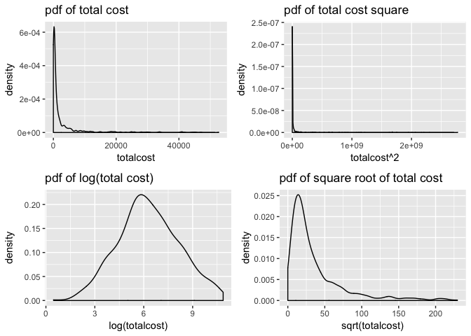
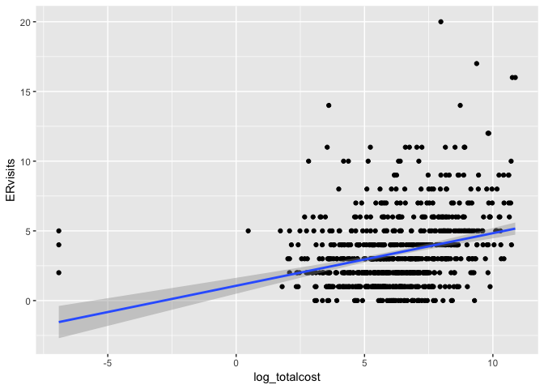

Homework 4
================
Xinyi Lin
11/9/2018

Problem 1
=========

Question 1
----------

$$b\_1 = \\frac{n\\sum x\_iY\_i-\\sum x\_i\\sum Y\_i}{n\\sum x^2\_i-(\\sum x\_i)^2} = \\frac{\\sum x\_iY\_i-n\\hat{Y}\\bar{x}}{\\sum x\_i^2 - n\\bar{x}^2} $$

$$b\_0 = \\hat{Y} - b\_1 \\bar{x} $$
 Since

$$ \\sum x\_iY\_i - n\\bar{Y}\\bar{x} = \\sum x\_iY\_i-\\bar{x}\\sum Y\_i = \\sum(x\_i-\\bar{x})Y\_i $$

So, the expectation of *b*<sub>1</sub>'s numerator is

$$
\\begin{split}
E\\{\\sum (x\_i-\\bar{x})Y\_i\\} & =\\sum (x\_i-\\bar{x})E(Y\_i)\\\\
& =\\sum(x\_i - \\bar{x})(\\beta\_0+\\beta\_1x\_i)\\\\
& =\\beta\_0\\sum x\_i-n\\bar{x}\\beta\_0+\\beta\_1\\sum{x\_i}^2-n\\bar{x}^2\\beta\_1\\\\
& =\\beta\_1(\\sum{x\_i^2}-n\\bar{x}^2)
\\end{split} 
$$

So
So *b*<sub>1</sub> and *b*<sub>0</sub> are unbiased estimators of *β*<sub>1</sub> and *β*<sub>0</sub>.

Question 2
----------

As $\\hat{\\beta\_0}=\\bar{Y}-\\hat{\\beta\_1}$, $b\_1 = \\frac{n\\sum x\_iY\_i-\\sum x\_i\\sum Y\_i}{n\\sum x^2\_i-(\\sum x\_i)^2} = \\frac{\\sum x\_iY\_i-n\\hat{Y}\\bar{x}}{\\sum x\_i^2 - n\\bar{x}^2}$ and estimated regression model $\\hat{Y\_i}=\\hat{\\beta\_0}+\\hat{\\beta\_1}x\_i$,

when $x\_i=\\bar{x}$,

$$\\hat{Y\_i}=\\bar{Y}-\\hat{\\beta\_1}\\bar{x}+\\hat{\\beta\_1}\\bar{x}=\\bar{Y}$$
 so regression model always goes through the point $(\\bar{x},\\bar{y})$.

``` r
library(tidyverse)
```

    ## ── Attaching packages ──────────────────────────────────────────────────────────────────────── tidyverse 1.2.1 ──

    ## ✔ ggplot2 3.0.0     ✔ purrr   0.2.5
    ## ✔ tibble  1.4.2     ✔ dplyr   0.7.6
    ## ✔ tidyr   0.8.1     ✔ stringr 1.3.1
    ## ✔ readr   1.1.1     ✔ forcats 0.3.0

    ## ── Conflicts ─────────────────────────────────────────────────────────────────────────── tidyverse_conflicts() ──
    ## ✖ dplyr::filter() masks stats::filter()
    ## ✖ dplyr::lag()    masks stats::lag()

``` r
library(patchwork)
```

Problem 2
=========

First, we need to import data

``` r
HeartDisease_df = read_csv("./data/HeartDisease.csv") 
```

    ## Parsed with column specification:
    ## cols(
    ##   id = col_integer(),
    ##   totalcost = col_double(),
    ##   age = col_integer(),
    ##   gender = col_integer(),
    ##   interventions = col_integer(),
    ##   drugs = col_integer(),
    ##   ERvisits = col_integer(),
    ##   complications = col_integer(),
    ##   comorbidities = col_integer(),
    ##   duration = col_integer()
    ## )

``` r
head(HeartDisease_df)
```

    ## # A tibble: 6 x 10
    ##      id totalcost   age gender interventions drugs ERvisits complications
    ##   <int>     <dbl> <int>  <int>         <int> <int>    <int>         <int>
    ## 1     1      179.    63      0             2     1        4             0
    ## 2     2      319     59      0             2     0        6             0
    ## 3     3     9311.    62      0            17     0        2             0
    ## 4     4      281.    60      1             9     0        7             0
    ## 5     5    18727.    55      0             5     2        7             0
    ## 6     6      453.    66      0             1     0        3             0
    ## # ... with 2 more variables: comorbidities <int>, duration <int>

Question 1
----------

This dataset includes 788 observations and 10 variables. Among variables, main outcome is `totalcost` and main predictor is `ERvisits`.

Then, we show descriptive statistics for all variables of interest.

``` r
mean_and_sd = function(x) {
  
  if (!is.numeric(x)) {
    stop("Argument x should be numeric")
  } else if (length(x) == 1) {
    stop("Cannot be computed for length 1 vectors")
  }
  
  mean_x = mean(x)
  sd_x = sd(x)

  list(mean = mean_x, 
       sd = sd_x)
}
```

`totalcost`

``` r
mean_and_sd(HeartDisease_df$totalcost)
```

    ## $mean
    ## [1] 2799.956
    ## 
    ## $sd
    ## [1] 6690.26

`ERvisits`

``` r
mean_and_sd(HeartDisease_df$ERvisits)
```

    ## $mean
    ## [1] 3.425127
    ## 
    ## $sd
    ## [1] 2.637474

`age`

``` r
mean_and_sd(HeartDisease_df$age)
```

    ## $mean
    ## [1] 58.71827
    ## 
    ## $sd
    ## [1] 6.754118

`gender`

``` r
summary(as.factor(HeartDisease_df$gender))
```

    ##   0   1 
    ## 608 180

`complications`

``` r
summary(as.factor(HeartDisease_df$complications))
```

    ##   0   1   3 
    ## 745  42   1

Question 2
----------

``` r
total_plot =
  HeartDisease_df %>% 
  ggplot(aes(x = totalcost)) +
  geom_density() +
  labs(title = "pdf of total cost")
```

``` r
log_plot = 
  HeartDisease_df %>% 
  ggplot(aes(x = log(totalcost))) +
  geom_density() +
  labs(title = "pdf of log(total cost)")
```

``` r
sqrt_plot = 
  HeartDisease_df %>% 
  ggplot(aes(x = sqrt(totalcost))) +
  geom_density() +
  labs(title = "pdf of square root of total cost")
```

``` r
square_plot = 
  HeartDisease_df %>% 
  ggplot(aes(x = totalcost^2)) +
  geom_density() +
  labs(title = "pdf of total cost square")
```

``` r
(total_plot + square_plot)/(log_plot + sqrt_plot)
```

    ## Warning: Removed 3 rows containing non-finite values (stat_density).



Above are distribution of total cost, log(totalcost), suqre root of totalcost and totalcost square. We can find that apply log to total cost is the best transformations.

Question 3
----------

``` r
HeartDisease_df =
  HeartDisease_df %>% 
  mutate(comp_bin = ifelse(complications == 0, 0, 1)) %>% 
  mutate(totalcost = ifelse(totalcost == 0, 0.001, totalcost))

head(HeartDisease_df)
```

    ## # A tibble: 6 x 11
    ##      id totalcost   age gender interventions drugs ERvisits complications
    ##   <int>     <dbl> <int>  <int>         <int> <int>    <int>         <int>
    ## 1     1      179.    63      0             2     1        4             0
    ## 2     2      319     59      0             2     0        6             0
    ## 3     3     9311.    62      0            17     0        2             0
    ## 4     4      281.    60      1             9     0        7             0
    ## 5     5    18727.    55      0             5     2        7             0
    ## 6     6      453.    66      0             1     0        3             0
    ## # ... with 3 more variables: comorbidities <int>, duration <int>,
    ## #   comp_bin <dbl>

Question 4
----------

``` r
HeartDisease_df %>% 
  mutate(log_totalcost = log(totalcost)) %>% 
  ggplot(aes(x = log_totalcost, y = ERvisits)) +
  geom_point() +
  geom_smooth(method = 'lm',formula = y~x)
```



``` r
reg_Heart = 
  HeartDisease_df %>% 
  mutate(log_totalcost = log(totalcost)) %>% 
  #filter(is.finite(log_totalcost)) %>% 
  lm(formula = log_totalcost ~ ERvisits, data = .) 

reg_Heart %>% 
  broom::tidy()
```

    ## # A tibble: 2 x 5
    ##   term        estimate std.error statistic   p.value
    ##   <chr>          <dbl>     <dbl>     <dbl>     <dbl>
    ## 1 (Intercept)    5.49     0.114      48.2  3.56e-237
    ## 2 ERvisits       0.225    0.0263      8.53 7.39e- 17

``` r
summary(reg_Heart)
```

    ## 
    ## Call:
    ## lm(formula = log_totalcost ~ ERvisits, data = .)
    ## 
    ## Residuals:
    ##      Min       1Q   Median       3Q      Max 
    ## -13.5255  -1.0922   0.0608   1.3147   4.3314 
    ## 
    ## Coefficients:
    ##             Estimate Std. Error t value Pr(>|t|)    
    ## (Intercept)  5.49384    0.11387  48.248   <2e-16 ***
    ## ERvisits     0.22477    0.02635   8.531   <2e-16 ***
    ## ---
    ## Signif. codes:  0 '***' 0.001 '**' 0.01 '*' 0.05 '.' 0.1 ' ' 1
    ## 
    ## Residual standard error: 1.949 on 786 degrees of freedom
    ## Multiple R-squared:  0.08475,    Adjusted R-squared:  0.08359 
    ## F-statistic: 72.78 on 1 and 786 DF,  p-value: < 2.2e-16

According to the results, we can find that adjusted R-squared is 0.1014 which is very closed to 0 and means this simple linear model is not a proper model. However, p-value is lower than 2.2e-16, which means the slope is significant and there are positive relationship between log of total cost and number of emergency room visits.

Interpretation: The slop of model is 0.227 which means if the number of emergency room vistis increases by 1 unit, the log of total cost will increase 0.452 units.

Question 5
----------

Test if `comp_bin` is an effect modifier

``` r
reg_modifier_Heart = 
  HeartDisease_df %>% 
  mutate(log_totalcost = log(totalcost)) %>% 
  #filter(is.finite(log_totalcost)) %>% 
  lm(formula = log_totalcost ~ ERvisits + comp_bin + ERvisits*comp_bin, data = .) 

reg_modifier_Heart %>% 
  broom::tidy()
```

    ## # A tibble: 4 x 5
    ##   term              estimate std.error statistic   p.value
    ##   <chr>                <dbl>     <dbl>     <dbl>     <dbl>
    ## 1 (Intercept)         5.46      0.114     47.8   1.12e-234
    ## 2 ERvisits            0.208     0.0271     7.70  4.01e- 14
    ## 3 comp_bin            2.22      0.602      3.69  2.39e-  4
    ## 4 ERvisits:comp_bin  -0.0964    0.105     -0.921 3.57e-  1

``` r
summary(reg_modifier_Heart)
```

    ## 
    ## Call:
    ## lm(formula = log_totalcost ~ ERvisits + comp_bin + ERvisits * 
    ##     comp_bin, data = .)
    ## 
    ## Residuals:
    ##      Min       1Q   Median       3Q      Max 
    ## -13.4051  -1.0559   0.0325   1.2269   4.4353 
    ## 
    ## Coefficients:
    ##                   Estimate Std. Error t value Pr(>|t|)    
    ## (Intercept)        5.45548    0.11406  47.828  < 2e-16 ***
    ## ERvisits           0.20837    0.02705   7.703 4.01e-14 ***
    ## comp_bin           2.22320    0.60233   3.691 0.000239 ***
    ## ERvisits:comp_bin -0.09639    0.10461  -0.921 0.357103    
    ## ---
    ## Signif. codes:  0 '***' 0.001 '**' 0.01 '*' 0.05 '.' 0.1 ' ' 1
    ## 
    ## Residual standard error: 1.911 on 784 degrees of freedom
    ## Multiple R-squared:  0.1227, Adjusted R-squared:  0.1193 
    ## F-statistic: 36.55 on 3 and 784 DF,  p-value: < 2.2e-16

Since the corresponding p-value of 'ERvisits\*comp\_bin' is 0.357 which is bigger than 0.05, we can conclude that there is no interaction between `ERvisits` and `comp_bin` and `comp_bin` is not a modifier.

Test if `comp_bin` is a confunder.

``` r
reg_confounder_Heart = 
  HeartDisease_df %>% 
  mutate(log_totalcost = log(totalcost)) %>% 
  #filter(is.finite(log_totalcost)) %>% 
  lm(formula = log_totalcost ~ ERvisits + comp_bin, data = .) 

reg_confounder_Heart %>% 
  broom::tidy()
```

    ## # A tibble: 3 x 5
    ##   term        estimate std.error statistic   p.value
    ##   <chr>          <dbl>     <dbl>     <dbl>     <dbl>
    ## 1 (Intercept)    5.48     0.112      49.1  2.79e-241
    ## 2 ERvisits       0.202    0.0261      7.73 3.33e- 14
    ## 3 comp_bin       1.74     0.303       5.75 1.27e-  8

``` r
summary(reg_confounder_Heart)
```

    ## 
    ## Call:
    ## lm(formula = log_totalcost ~ ERvisits + comp_bin, data = .)
    ## 
    ## Residuals:
    ##      Min       1Q   Median       3Q      Max 
    ## -13.3943  -1.0451   0.0252   1.2191   4.4397 
    ## 
    ## Coefficients:
    ##             Estimate Std. Error t value Pr(>|t|)    
    ## (Intercept)  5.47693    0.11165  49.054  < 2e-16 ***
    ## ERvisits     0.20193    0.02613   7.728 3.33e-14 ***
    ## comp_bin     1.74365    0.30321   5.751 1.27e-08 ***
    ## ---
    ## Signif. codes:  0 '***' 0.001 '**' 0.01 '*' 0.05 '.' 0.1 ' ' 1
    ## 
    ## Residual standard error: 1.911 on 785 degrees of freedom
    ## Multiple R-squared:  0.1218, Adjusted R-squared:  0.1195 
    ## F-statistic: 54.41 on 2 and 785 DF,  p-value: < 2.2e-16

When adding `comp_bin` in model the association between `log_totalcost` and `ERvisits` becomes smaller but still significant and the regression coefficient decreased by 10.2%, so `comp_bin` is a confounder.

Since `comp_bin` is a confounder but not a modifier, we use 'Partial' F-test to test whether we should include `comp_bin` as a factor.

Model 1: *Y*<sub>*i*</sub> = *β*<sub>0</sub> + *β*<sub>1</sub>*X*<sub>*i*1</sub> + *β*<sub>2</sub>*X*<sub>*i*2</sub> + *ε*<sub>*i*</sub>

Model 2: *Y*<sub>*i*</sub> = *β*<sub>0</sub> + *β*<sub>1</sub>*X*<sub>*i*1</sub> + *ε*<sub>*i*</sub>

Among which, *X*<sub>1</sub> represents `ER_visits`, *X*<sub>2</sub> represents `comp_bin`.

Null hypothesis *H*<sub>*O*</sub> : *β*<sub>2</sub> = 0, alternative hypothesis *H*<sub>1</sub> : *β*<sub>2</sub> ≠ 0

``` r
anova(reg_confounder_Heart, reg_Heart) %>% 
  broom::tidy()
```

    ## Warning: Unknown or uninitialised column: 'term'.

    ## # A tibble: 2 x 6
    ##   res.df   rss    df sumsq statistic       p.value
    ## *  <dbl> <dbl> <dbl> <dbl>     <dbl>         <dbl>
    ## 1    785 2866.    NA   NA       NA   NA           
    ## 2    786 2987.    -1 -121.      33.1  0.0000000127

According to results, p-value is smaller than 0.01 so we reject *H*<sub>0</sub> and conclude that Model 1 is 'superior'.As a resuit, we should include `comp_bin`.

Question 6
----------

``` r
reg_added_Heart = 
  HeartDisease_df %>% 
  mutate(log_totalcost = log(totalcost)) %>% 
  #filter(is.finite(log_totalcost)) %>% 
  lm(formula = log_totalcost ~ ERvisits + comp_bin + age + gender + duration, data = .) 

reg_added_Heart %>% 
  broom::tidy()
```

    ## # A tibble: 6 x 5
    ##   term        estimate std.error statistic  p.value
    ##   <chr>          <dbl>     <dbl>     <dbl>    <dbl>
    ## 1 (Intercept)  5.80     0.556        10.4  5.91e-24
    ## 2 ERvisits     0.173    0.0246        7.05 4.07e-12
    ## 3 comp_bin     1.53     0.282         5.45 6.89e- 8
    ## 4 age         -0.0193   0.00945      -2.05 4.10e- 2
    ## 5 gender      -0.323    0.151        -2.14 3.26e- 2
    ## 6 duration     0.00606  0.000533     11.4  6.76e-28

``` r
summary(reg_added_Heart)
```

    ## 
    ## Call:
    ## lm(formula = log_totalcost ~ ERvisits + comp_bin + age + gender + 
    ##     duration, data = .)
    ## 
    ## Residuals:
    ##      Min       1Q   Median       3Q      Max 
    ## -12.1885  -0.9962  -0.0838   1.0099   4.3499 
    ## 
    ## Coefficients:
    ##               Estimate Std. Error t value Pr(>|t|)    
    ## (Intercept)  5.8016080  0.5559910  10.435  < 2e-16 ***
    ## ERvisits     0.1732359  0.0245897   7.045 4.07e-12 ***
    ## comp_bin     1.5335773  0.2815738   5.446 6.89e-08 ***
    ## age         -0.0193389  0.0094493  -2.047   0.0410 *  
    ## gender      -0.3234418  0.1510875  -2.141   0.0326 *  
    ## duration     0.0060629  0.0005325  11.386  < 2e-16 ***
    ## ---
    ## Signif. codes:  0 '***' 0.001 '**' 0.01 '*' 0.05 '.' 0.1 ' ' 1
    ## 
    ## Residual standard error: 1.769 on 782 degrees of freedom
    ## Multiple R-squared:  0.2502, Adjusted R-squared:  0.2454 
    ## F-statistic: 52.18 on 5 and 782 DF,  p-value: < 2.2e-16

According to results, we can find all p-value of covariates are smaller than 0.01, so all covariates have significant influence in total cost.

We use 'Partial' F-test to compare SLR and MLR models.

Model 1: *Y*<sub>*i*</sub> = *β*<sub>0</sub> + *β*<sub>1</sub>*X*<sub>*i*1</sub> + *β*<sub>2</sub>*X*<sub>*i*2</sub> + *β*<sub>3</sub>*X*<sub>*i*3</sub> + *β*<sub>4</sub>*X*<sub>*i*4</sub> + *β*<sub>5</sub>*X*<sub>*i*5</sub> + *ε*<sub>*i*</sub>

Model 2: *Y*<sub>*i*</sub> = *β*<sub>0</sub> + *β*<sub>1</sub>*X*<sub>*i*1</sub> + *ε*<sub>*i*</sub>

Among which, *X*<sub>1</sub> represents `ERvisits`, *X*<sub>2</sub> represents `comp_bin`, *X*<sub>3</sub> represents `age`, *X*<sub>4</sub> represents `gender`, *X*<sub>5</sub> represents `duration`.

Null hypothesis *H*<sub>*O*</sub> : *β*<sub>2</sub> = *β*<sub>3</sub> = *β*<sub>4</sub> = *β*<sub>5</sub> = 0, alternative hypothesis *H*<sub>1</sub>: at least one of *β* is not zero.

``` r
anova(reg_Heart, reg_added_Heart) %>% broom::tidy()
```

    ## Warning: Unknown or uninitialised column: 'term'.

    ## # A tibble: 2 x 6
    ##   res.df   rss    df sumsq statistic   p.value
    ## *  <dbl> <dbl> <dbl> <dbl>     <dbl>     <dbl>
    ## 1    786 2987.    NA   NA       NA   NA       
    ## 2    782 2447.     4  540.      43.1  1.00e-32

According to the ANOVA results, p-value is smaller than 0.01 so we reject *H*<sub>0</sub> and conclude that Model 1 is 'superior'.As a resuit, we should use MLR model.

Problem 3
=========

First, we import data

``` r
PatSatisfaction_df = readxl::read_xlsx("./data/PatSatisfaction.xlsx") %>% 
  janitor::clean_names() %>% 
  reshape::rename(c(safisfaction = "satisfaction"))

head(PatSatisfaction_df)
```

    ## # A tibble: 6 x 4
    ##   satisfaction   age severity anxiety
    ##          <dbl> <dbl>    <dbl>   <dbl>
    ## 1           48    50       51     2.3
    ## 2           57    36       46     2.3
    ## 3           66    40       48     2.2
    ## 4           70    41       44     1.8
    ## 5           89    28       43     1.8
    ## 6           36    49       54     2.9

Question 1
----------

``` r
PatSatisfaction_df %>% 
  cor()
```

    ##              satisfaction        age   severity    anxiety
    ## satisfaction    1.0000000 -0.7867555 -0.6029417 -0.6445910
    ## age            -0.7867555  1.0000000  0.5679505  0.5696775
    ## severity       -0.6029417  0.5679505  1.0000000  0.6705287
    ## anxiety        -0.6445910  0.5696775  0.6705287  1.0000000

According to the correlation matrix, we can find that all `age`, `severity`, `anxirty` have negative relationship with satisfaction and the relationship between `age` and `satisfaction` is stronger than `severity` and `anxiety` .

Question 2
----------

Assuming the model is
*Y*<sub>*i*</sub> = *β*<sub>0</sub> + *β*<sub>1</sub>*X*<sub>*i*1</sub> + *β*<sub>2</sub>*X*<sub>*i*2</sub> + *β*<sub>3</sub>*X*<sub>*i*3</sub> + *ε*<sub>*i*</sub>
 Among which, *X*<sub>1</sub> represents `age`, *X*<sub>2</sub> represents `severity`, *X*<sub>3</sub> represents `anxiety`.

Null hypothesis *H*<sub>0</sub> : *β*<sub>0</sub> = *β*<sub>1</sub> = *β*<sub>2</sub> = *β*<sub>3</sub> = 0, alternative hypothesis *H*<sub>1</sub>: at least one *β* is not zero.

Decision rule:

If $F^\* = \\frac{MSR}{MSE} &gt; F(1-\\alpha;p,n-p-1)$, reject *H*<sub>0</sub>,

if $F^\* = \\frac{MSR}{MSE} \\leq F(1-\\alpha;p,n-p-1)$, fail to reject *H*<sub>0</sub>.

with a significance level of 0.05, *α* = 0.05

``` r
reg_all = 
  PatSatisfaction_df %>%
  lm(satisfaction ~ age + severity + anxiety, data = .)

summary(reg_all)
```

    ## 
    ## Call:
    ## lm(formula = satisfaction ~ age + severity + anxiety, data = .)
    ## 
    ## Residuals:
    ##      Min       1Q   Median       3Q      Max 
    ## -18.3524  -6.4230   0.5196   8.3715  17.1601 
    ## 
    ## Coefficients:
    ##             Estimate Std. Error t value Pr(>|t|)    
    ## (Intercept) 158.4913    18.1259   8.744 5.26e-11 ***
    ## age          -1.1416     0.2148  -5.315 3.81e-06 ***
    ## severity     -0.4420     0.4920  -0.898   0.3741    
    ## anxiety     -13.4702     7.0997  -1.897   0.0647 .  
    ## ---
    ## Signif. codes:  0 '***' 0.001 '**' 0.01 '*' 0.05 '.' 0.1 ' ' 1
    ## 
    ## Residual standard error: 10.06 on 42 degrees of freedom
    ## Multiple R-squared:  0.6822, Adjusted R-squared:  0.6595 
    ## F-statistic: 30.05 on 3 and 42 DF,  p-value: 1.542e-10

According to results, we can find *F*<sup>\*</sup> = 30.05 &gt; 2.8270487, so we reject *H*<sub>0</sub> and conclude that there is a regression relation.

Question 3
----------

``` r
reg_all %>% broom::tidy()
```

    ## # A tibble: 4 x 5
    ##   term        estimate std.error statistic  p.value
    ##   <chr>          <dbl>     <dbl>     <dbl>    <dbl>
    ## 1 (Intercept)  158.       18.1       8.74  5.26e-11
    ## 2 age           -1.14      0.215    -5.31  3.81e- 6
    ## 3 severity      -0.442     0.492    -0.898 3.74e- 1
    ## 4 anxiety      -13.5       7.10     -1.90  6.47e- 2

``` r
confint(reg_all)
```

    ##                  2.5 %      97.5 %
    ## (Intercept) 121.911727 195.0707761
    ## age          -1.575093  -0.7081303
    ## severity     -1.434831   0.5508228
    ## anxiety     -27.797859   0.8575324

By using function `confint`, we get 95% CIs of all estimators. The 95% CIs of `severity` is (-1.4348, 0.5508) which means at *α* = 0.05 significant level, we can conclude that the true coefficient of `severity` is between -1.4348 and 0.5508. The estimated coefficient of `severity` is -0.442 which means if the value of `severity` increased by 1 units, the value of satisfaction will decrease 0.442 given all other values of predictors stay constant.

Question 4
----------

``` r
list(age = 35, severity = 42, anxiety = 2.1) %>% 
  predict(object = reg_all, newdata = ., interval = "predict")
```

    ##        fit      lwr      upr
    ## 1 71.68332 50.06237 93.30426

By using `predict` function, we can get the prediction interval for the new patient's satisfaction is (50.0624, 93.3042).

Interprest: We are 95% confident that the the new patient's satisfaction fall within (50.0624, 93.3042) given `age` equals 35, `severity` equals 42 and `anxiety` equals 2.1

Question 5
----------

Model 1: *Y*<sub>*i*</sub> = *β*<sub>0</sub> + *β*<sub>1</sub>*X*<sub>*i*1</sub> + *β*<sub>2</sub>*X*<sub>*i*2</sub> + *β*<sub>3</sub>*X*<sub>*i*3</sub> + *ε*<sub>*i*</sub>

Model 2: *Y*<sub>*i*</sub> = *β*<sub>0</sub> + *β*<sub>1</sub>*X*<sub>*i*1</sub> + *β*<sub>2</sub>*X*<sub>*i*2</sub> + *ε*<sub>*i*</sub>

Among which, *X*<sub>1</sub> represents `age`, *X*<sub>2</sub> represents `severity`, *X*<sub>3</sub> represents `anxiety`.

We use 'Partial' F-test for nested models. Null hypothesis *H*<sub>*O*</sub> : *β*<sub>3</sub> = 0, alternative hypothesis *H*<sub>1</sub> : *β*<sub>3</sub> ≠ 0

Decision rule:

$$ F^\*=\\frac{(SSR\_L-SSR\_S)/(df\_L-df\_S)}{\\frac{SSE\_L}{df\_L}} \\sim F\_{df\_L-df\_S,dfL} $$

where *d**f*<sub>*S*</sub> = *n* − *p*<sub>*S*</sub> − 1, *d**f*<sub>*L*</sub> = *n* − *p*<sub>*L*</sub> − 1.

If *F*<sup>\*</sup> &gt; *F*(1 − *α*; *d**f*<sub>*L*</sub> − *d**f*<sub>*S*</sub>, *d**f*<sub>*L*</sub>), reject *H*<sub>0</sub>;

If *F*<sup>\*</sup> ≤ *F*(1 − *α*; *d**f*<sub>*L*</sub> − *d**f*<sub>*S*</sub>, *d**f*<sub>*L*</sub>), fail to reject *H*<sub>0</sub>.

With *α* = 0.05, when *p* − *v**a**l**u**e* ≥ 0.05, fail to reject *H*<sub>0</sub>, when *p* − *v**a**l**u**e* &lt; 0.05, reject *H*<sub>0</sub>.

``` r
reg_without_anxiety = 
  PatSatisfaction_df %>%
  lm(satisfaction ~ age + severity, data = .)

anova(reg_all, reg_without_anxiety) %>% 
  broom::tidy()
```

    ## Warning: Unknown or uninitialised column: 'term'.

    ## # A tibble: 2 x 6
    ##   res.df   rss    df sumsq statistic p.value
    ## *  <dbl> <dbl> <dbl> <dbl>     <dbl>   <dbl>
    ## 1     42 4249.    NA   NA      NA    NA     
    ## 2     43 4613.    -1 -364.      3.60  0.0647

According to the ANOVA results, p-value is 0.0647 which is larger than 0.05, so we fail to reject *H*<sub>0</sub> and conclude that Model 1 is not 'superior\` and we should use Model 2.
